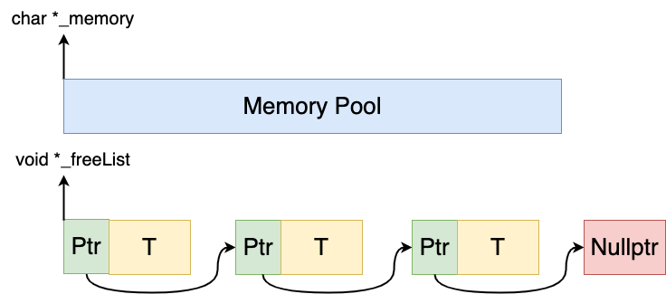
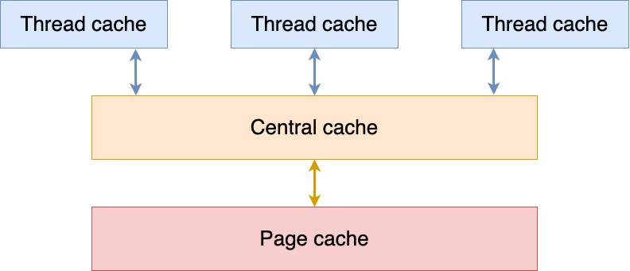
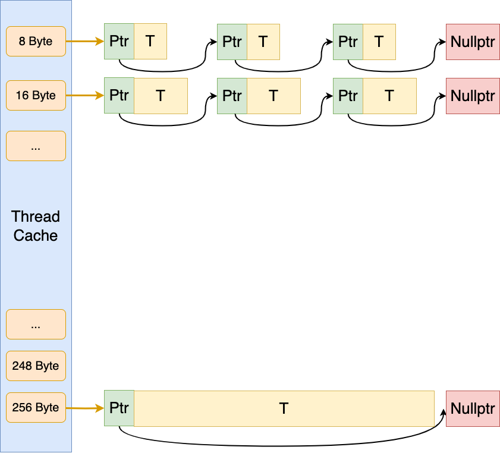

https://blog.csdn.net/ETalien_/article/details/88832703

https://jiajunhuang.com/articles/2020_10_10-tcmalloc.md.html

## *定长内存池*

### intro

定长对象的内存池，每次申请或者归还一个固定大小的内存对象T，定长内存池可以满足固定大小的内存申请释放需求，并且定长内存池在高并发内存池中可以被复用

定长内存池的特点是

* 性能达到极致
* 不考虑内存碎片等问题

### 实现



用自由链表 `void *_freeList` 来管理切好的小块内存，内存块头上存下一个内存块的地址，因此一个内存块至少要存4字节（32位）或8字节（64位）

若剩余的空间不够分配一块内存了该怎么办？引入 `_remainByte` 管理 

```cpp

```


可以用这种方式来判断当前系统是32位还是64位，然后强转

```cpp
if (sizeof(int *) == 32) //32位
    *((int *)obj) = nullptr; 
else //64位
    *((long long*)obj) = nullptr; 
```

## *整体设计框架*

### tcmalloc 介绍

tcmalloc（Thread-Caching Malloc）是Google开发的一种用于多线程应用程序的内存分配器，在许多Google项目中得到广泛应用。tcmalloc旨在提供高效的内存分配和释放，**以减少多线程应用程序中的锁竞争和内存碎片化**

tcmalloc的设计目标是在**多线程环境下**最大限度地减少内存分配和释放的开销。它采用了许多优化策略来提高性能和可伸缩性

其中一个关键特性是线程本地缓存（Thread-Caching），它为每个线程维护了一个本地内存缓存，用于快速分配和释放内存。通过避免对全局数据结构的频繁访问，减少了锁竞争的情况，从而提高了性能

另一个重要的特性是分离的内存池（Central Cache），它用于处理大于某个阈值的内存分配请求。这些请求在被满足之前不会返回到操作系统，而是在内存池中进行高效的重用。这有助于减少对操作系统的系统调用次数，提高了性能

此外，tcmalloc还使用了一些其他的优化技术，如高效的内存块分配策略、精细的大小分类等，以提高内存分配的效率和内存利用率。

总的来说，tcmalloc是一种针对多线程应用程序的高性能内存分配器，通过利用线程本地缓存、分离的内存池和其他优化策略，提供了快速的内存分配和释放，并减少了锁竞争和内存碎片化的问题

### 三层设计



* Thread cache 解决锁竞争的问题：线程缓存是每个线程独有的，用于小于256KB的内存的分配，线程从这里申请内存不需要加锁，每个线程独享一个cache，这也就是这个并发线程池高效的地方

* Central cache 居中调度

  * central cache 是所有线程所共享的，thread cache按需从central cache中获取对象，central cache也会在合适的时机回收thread cache中的对象。central cache有负载均衡的作用，可以避免一个线程抢占过多内存

  * 因为central cache是共享的，所有存在竞争。但是通过哈希桶的设计，这里竞争不会很激烈。其次只有本身只有thread cache的

    没有内存对象时才会找central cache，所以更降低了竞争烈度

* Page cache 以页为单位管理大内存，用brk或mmap直接找OS的堆要内存

## *Thread Cache*



### 哈希桶对齐规则

若要1字节，给8字节；要2字节，也给8字节；要8字节，还给8字节。存在一定的空间浪费

为了存下64位指针，毋庸置疑最少值肯定是8字节

若全部`256 * 1024 / 8 = 32768` 

整体控制在最多10%左右的内碎片浪费

// [1,128] 8byte对齐 freelist[0,16)

// [128+1,1024] 16byte对齐 freelist[16,72)

// [1024+1,8*1024] 128byte对齐 freelist[72,128)

// [8*1024+1,64*1024] 1024byte对齐 freelist[128,184)

// [64*1024+1,256*1024] 8*1024byte对齐 freelist[184,208)


### TLS无锁访问

## *Central Cache*

## *Page Cache*
